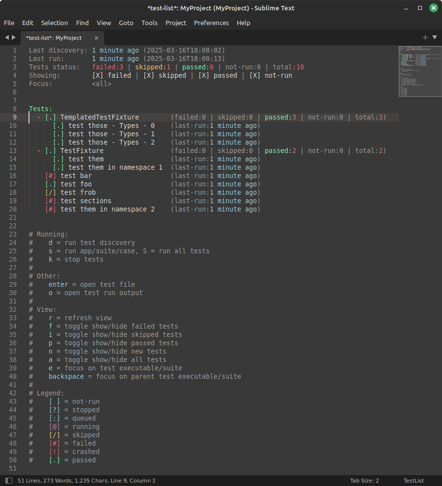

# TestExplorer



## Intro

This extension for Sublime Text 4 allows listing, running, and inspecting the results of tests. It currently supports the following test frameworks:

 - C++: Catch2, doctest, GoogleTest
 - Python: pytest
 - Rust: cargo test (nightly only)

The core architecture is language agnostic, and can work in principle with any language or framework not listed above. However, each framework generally has its own command-line interface and reporting format, which requires bespoke logic to handle. If your favorite test framework is not listed above, you can write your own runner/parser and [register it with TestExplorer](#register-custom-framework).


## Installation

 1. Install the TestExplorer package (e.g., from Package Control).
 2. Open a Sublime Text project for which you want to run tests. A project is required, so if you don't have one already, create it.
 3. Edit your project settings ("Project > Edit Project") and define at least one test framework. See [Adding a test framework](#adding-a-test-framework) for details.
 4. Run the command `TestExplorer: List Tests`. This should display an empty list.
 5. Press the `d` key to run test discovery. Your tests should now appear, and you are ready to go. Follow the help text at the bottom of the test list to get started.
 6. (optional) Configure custom color scheme for test statuses, for a nicer test list. See [Custom test status colors](#custom-test-status-colors).


## Adding a test framework

Frameworks are added to your project settings in the following way:

```json
{
    "settings":
    {
        "TestExplorer":
        {
            "frameworks": [
                {
                    "id": "framework1",
                    ...
                },
                {
                    "id": "framework2",
                    ...
                },
                ...
            ]
        }
    }
}
```

Inside the `"frameworks"` array, you can list as many test frameworks as you need. The format of each entry is specific to the type of the framework, however there are a number of fields that are common to all test frameworks:

 - `"id"`: A unique identifier for this framework; choose manually. If changed, all test results recorded with the old ID will be lost.
 - `"type"`: The type of the framework. This determines how tests are discovered and run, and also sets up a suitable default parser. Possible values:
    - `"gtest"`: GoogleTest (C++).
    - `"doctest-cpp"`: doctest (C++).
    - `"catch2"`: Catch2 (C++).
    - `"pytest"`: pytest (Python).
    - `"cargo"`: cargo test (Rust).
 - "path_prefix_style": This determines how file paths are displayed in the test list. This includes for example the paths to test executables, or the paths to test files. Possible values:
    - `"full"`: (default) Show the full file paths, relative to the root of the project.
    - `"basename"`: Show only the file name.
    - `"none"`: Do not show file paths.
 - `"custom_prefix"`: If set, this introduces an additional prefix to all tests discovered within this framework. Can be useful to group tests from similar frameworks (e.g., same language) or to ensure that tests from different frameworks are well separated. The default is `null`, which does not add any prefix.
 - `"args"`: A list of additional command-line arguments that will be passed to the test framework on each invocation (for whatever purpose). Default to an empty list.
 - `"discovery_args"`: A list of additional command-line arguments that will be passed to the test framework, only during test discovery. This is added to the list in `"args"`. Default to an empty list.
 - `"run_args"`: A list of additional command-line arguments that will be passed to the test framework, only during test execution. This is added to the list in `"args"`. Default to an empty list.
 - `"env"`: A dictionary of `{"VARIABLE": "value"}` to set environment variables on each invocation (for whatever purpose), and added to your operating system's default set of environment variables. Defaults to an empty dictionary.
 - `"cwd"`: The path to the current working directory to use when invoking the test framework. If this is supplied as an absolute path, it is used as is. If this is supplied as a relative path, it is interpreted as relative to the root of the project. Defaults to the root of the project.
 - `"parser"`: Specify which test parser to use. Possible values:
    - `"default"`: (default) use the default for the framework.
    - `"teamcity"`: parse TeamCity service messages.

The following sections describe fields that are specific to the chosen framework.


### Catch2 / Doctest / GoogleTest

The following field can also be set:

 - `"executable_pattern"`: Either a glob pattern (with `*` wildcard) or a single path defining which test executable(s) to include in the test discovery and test execution. If this is supplied as an absolute path, it is used as is. If this is supplied as a relative path, it is interpreted as relative to the root of the project. The default is to include all files at the root of the project, which is most likely not what you want. Unfortunately it is impossible for TestExplorer to guess where your test executables will end up, so this will generally need to be set.


### Pytest

The following field can also be set:

 - `"python"`: The name or path to the Python executable to use when running the tests. If this is supplied as an absolute path, or just as an executable name with no path, it is used as is. If this is supplied as a relative path, it is interpreted as relative to the root of the project.


### Cargo

The following field can also be set:

 - `"cargo"`: The name or path to the cargo executable to use when running the tests. If this is supplied as an absolute path, or just as an executable name with no path, it is used as is. If this is supplied as a relative path, it is interpreted as relative to the root of the project. If this is supplied as a list, then it is assumed to be a list of command-line entries and will be used as is.


## Internal data model

The content of this section is not necessary for using TestExplorer. It is for developers only, or those who wish to implement their own custom framework.

The data model is a tree-like structure, where each element is a `TestItem`. All tests are leaves of this tree (no children). Nodes of the tree correspond to groups of any kind: it could be a test class (fixture), a file, a folder, ... A node contains one or more child; each child can itself be another sub-group, or it can be a test. The data model makes no assumption about the meaning of this grouping structure, so each framework can only specify the grouping level it needs. For example, if the test framework has no concept of "test class", then that grouping level does not need to exist in the tree.

Each test is described by the following fields:

 - `name`: This is the name of this test (or group), excluding the name of its parent group (if any). For example, for a test function inside a class, this would be the name of the function.
 - `full_name`: This is the full name of the test (or group), including the name of all its parent groups, separated by a `/`. This is used for display only.
 - `discovery_id`: This is an integer which specifies the position of the test in the list output by the test framework during the last test discovery. This is used for display only (e.g., for sorting tests by discovery order). For groups, this is set to `0`.
 - `framework_id`: This is the unique ID of the framework instance from which this test (or group) was discovered. This is used to link the test to the right `TestFramework` class, e.g., for running the test.
 - `run_id`: This is the ID of the test to use when selecting this test for running. For example, the specific format to use when selecting this test on the command-line. This is normally the same as `report_id`. For groups, this is empty.
 - `report_id`: This is the ID of the test as it appears in the test report output by the test framework. This is normally the same as `run_id`. Some odd combinations of frameworks and reporters may result in different IDs being used for running and reporting (e.g., when using the TeamCity reporter, some characters are forbidden in the test name and are replaced by placeholders). For groups, this is empty.
 - `location`: This describes the executable, file, and line number at which the test definition was found. For groups, this is `None`. This is used for user navigation ("go to this test").
 - `last_status`: This is the outcome (pass/fail) of the test for its last run. For groups, this is computed from all the children.
 - `run_status`: This is the current state of the test; whether it is running or queued. This does not hold the test outcome (pass/fail). For groups, this is computed from all the children.
 - `last_run`: This is the date and time at which the test was last run. If the test was never run, this is `None`. For groups, this is `None`.
 - `children`: For groups, this is the list of the group's children. For tests, this is `None`.

NB: The above describes the data model in Python. When the test data is stored on disk, it is stored in an SQLite database, and each test is then a row in a table. Nodes of the tree are not stored on disk, because they do not contain any new information (their content is entirely derived from that of their respective children).


## Register custom framework

To add your own custom framework, you must create a new class that implements the `TestFramework` interface (see abstract base class definition in `test_framework.py`).

```python
from TestExplorer.test_framework import TestFramework

class YourTestFramework(TestFramework):
    def __init__(self, test_data: TestData):
        """
        Initialise any state you need.
        Note: The instance is not long-lived: it is created for the duration of the test discovery
        or test run, and destroyed afterwards. Any persistent state, e.g., the list and status of
        tests, should be stored in the TestData class.
        """
        pass

    def get_id(self) -> str:
        """
        Must return a string containing the unique ID of the framework instance.
        This will normally be the "id" field in the user JSON, but you can override that.
        """
        return "..."

    def discover(self) -> List[DiscoveredTest]:
        """
        Must run test discovery and return a list of discovered tests. The discovered tests will
        be registered with the TestData class automatically, you do not need to do this yourself.
        """
        return []

    def run(self, grouped_tests: Dict[str, List[str]]) -> None:
        """
        Must run the tests selected in `grouped_tests`.
        The tests are grouped by "executable" (as defined during test discovery), for efficiency.
        While tests are running, it is expected that this function will notify the TestData
        class of any of the following events:
         - TestData.notify_test_started()
         - TestData.notify_test_output()
         - TestData.notify_test_finished()
        """
        pass
```

You must then call somewhere:

```python
register_framework("name-of-your-framework", your_framework_factory_function)
```

... where `your_framework_factory_function` is a function that creates an instance of your framework class, constructed from the user-supplied JSON data (see [Adding a test framework](#adding-a-test-framework)). The signature of the factory function must be:

```python
def your_framework_factory_function(test_data: TestData, project_root_dir: str, json_data: Dict) -> YourTestFramework:
    # Extract useful parameters from json_data and forward them to your class.
    return YourTestFramework(test_data)
```

The builtin framework class for Google Test is a good example to emulate, and has one of the simplest parser. See `test_frameworks/gtest.py`.


## Custom test status colors

By default, the test list does not use different colors to display passed/failed/skipped tests, it only shows a different symbol. Using different colors can make it easier to read, and is recommended. Unfortunately this is difficult to do out-of-the-box for TestExplorer; the right colors to use will depend on your favorite color scheme (dark vs light, etc.).

To set up custom colors, go to "Preferences > Customize Color Scheme", and enter the following. Feel free to then edit the chosen colors to your liking.

```json
{
    "variables":
    {
    },
    "globals":
    {
    },
    "rules":
    [
        {
            "name": "TestExplorer failed (icon)",
            "scope": "string.other.test-explorer.status-marker.failed",
            "foreground": "#e9677e"
        },
        {
            "name": "TestExplorer failed (stats)",
            "scope": "comment.other.test-explorer.tests.failed.some",
            "foreground": "#e9677e"
        },
        {
            "name": "TestExplorer crashed (icon)",
            "scope": "string.other.test-explorer.status-marker.crashed",
            "foreground": "#e9677e"
        },
        {
            "name": "TestExplorer crashed (stats)",
            "scope": "comment.other.test-explorer.tests.crashed.some",
            "foreground": "#e9677e"
        },
        {
            "name": "TestExplorer stopped (icon)",
            "scope": "string.other.test-explorer.status-marker.stopped",
            "foreground": "#97d1ed"
        },
        {
            "name": "TestExplorer stopped (stats)",
            "scope": "comment.other.test-explorer.tests.stopped.some",
            "foreground": "#97d1ed"
        },
        {
            "name": "TestExplorer passed (icon)",
            "scope": "string.other.test-explorer.status-marker.passed",
            "foreground": "#7efbac"
        },
        {
            "name": "TestExplorer passed (stats)",
            "scope": "comment.other.test-explorer.tests.passed.some",
            "foreground": "#7efbac"
        },
        {
            "name": "TestExplorer skipped (icon)",
            "scope": "string.other.test-explorer.status-marker.skipped",
            "foreground": "#f0ce7b"
        },
        {
            "name": "TestExplorer skipped (stats)",
            "scope": "comment.other.test-explorer.tests.skipped.some",
            "foreground": "#f0ce7b"
        },
        {
            "name": "TestExplorer not-run (icon)",
            "scope": "string.other.test-explorer.status-marker.not-run",
            "foreground": "#97d1ed"
        },
        {
            "name": "TestExplorer not-run (stats)",
            "scope": "comment.other.test-explorer.tests.not-run.some",
            "foreground": "#97d1ed"
        },
        {
            "name": "TestExplorer running (icon)",
            "scope": "string.other.test-explorer.status-marker.running",
            "foreground": "#c582c3"
        },
    ]
}
```
